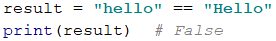
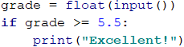
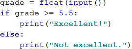

# Глава 3.1. Прости проверки

В настоящата глава ще разгледаме **условните конструкции в езика Python**, чрез които нашата програма може да има различно поведение, в зависимост от дадено условие. Ще обясним синтаксиса на условните оператори за проверки (**`if`**, **`if-elif`** и **`else`**) с подходящи примери и ще видим в какъв диапазон живее една променлива (нейният **обхват**). Накрая ще разгледаме техники за **дебъгване**, чрез които постъпково да проследяваме пътя, който извървява нашата програма по време на своето изпълнение.


## Видео

<div class="video-player">
  Гледайте видео-урок по тази глава тук: <a target="_blank"
  href="https://www.youtube.com/watch?v=cQIl0wQLVRE">
  https://www.youtube.com/watch?v=cQIl0wQLVRE</a>.
</div>


## Сравняване на числа

В програмирането можем да сравняваме стойности чрез следните **оператори**:

* Оператор **`<`** (по-малко)
* Оператор **`>`** (по-голямо)
* Оператор **`<=`** (по-малко или равно)
* Оператор **`>=`** (по-голямо или равно)
* Оператор **`==`** (равно)
* Оператор **`!=`** (различно)

При сравнение резултатът е булева стойност – **`True`** или **`False`**, в зависимост от това дали резултатът от сравнението е истина или лъжа.

### Примери за сравнение на числа


Обърнете внимание, че при отпечатване на стойностите **`true`** и **`false`** в езика **Python**, те се отпечатват с главна буква, съответно **`True`** и **`False`**.

### Оператори за сравнение

В езика Python можем да използваме следните оператори за сравнение на данни:

<table>
<tr>
<th>Оператор</th> <th>Означение</th> <th>Работи за</th>
</tr>
<tr>
<td>Проверка за равенство</td><td align="center"> == </td><td rowspan="2"> числа, стрингове, дати</td>
</tr>
<tr>
<td>Проверка за различие</td><td align="center"> != </td>
</tr>
<tr>
<td>По-голямо</td><td align="center"> > </td><td rowspan="4">числа, дати, други сравними типове</td>
</tr>
<tr>
<td>По-голямо или равно</td><td align="center"> >= </td>
</tr>
<tr>
<td>По-малко</td><td align="center"> &lt; </td>
</tr>
<tr>
<td>По-малко или равно</td><td align="center"> &lt;= </td>
</tr>
</table>

Ето един пример:



## Прости проверки

В програмирането често **проверяваме дадени условия** и извършваме различни действия, спрямо резултата от тези проверки. Проверките извършваме посредством **`if`** клаузи, които имат следната конструкция:

```python
if условие:
    # тяло на условната конструкция
```

### Пример: отлична оценка

Въвеждаме оценка в конзолата и проверяваме дали тя е отлична (**`≥ 5.50`**).



Тествайте кода от примера локално. Опитайте да въведете различни оценки, например **4.75**, **5.49**, **5.50** и **6.00**. При оценки **по-малки от 5.50** програмата няма да изведе нищо, а при оценка **5.50 или по-голяма**, ще изведе "**Excellent!**".

#### Тестване в Judge системата

Тествайте програмата от примера в Judge системата на СофтУни:
[https://judge.softuni.bg/Contests/Practice/Index/1049#0](https://judge.softuni.bg/Contests/Practice/Index/1049#0).


## Проверки с if-else конструкция

Конструкцията **`if`** може да съдържа и **`else`** клауза, с която да окажем конкретно действие в случай, че булевият израз (който е зададен в началото **`if булев израз`**) върне отрицателен резултат (**`False`**). Така построена, **условната конструкция** наричаме **`if-else`** и поведението ѝ е следното: ако резултатът от условието е **позитивен** (**`True`**) - извършваме едни действия, a когато е **негативен** (**`False`**) - други. Форматът на конструкцията е:

```python
if условие:
    # тяло на условната конструкция
else:
    # тяло на else конструкция
```

### Пример: отлична оценка или не

Подобно на горния пример, въвеждаме оценка, проверяваме дали е отлична, но **изписваме резултат и в двата случая**.



#### Тестване в Judge системата

Тествайте решението си тук: [https://judge.softuni.bg/Contests/Practice/Index/1049#1](https://judge.softuni.bg/Contests/Practice/Index/1049#1).


## За блокoвете от код

Чрез **табулация** създаваме блок от код, чрез който може да се изпълняват група от команди. Когато имаме код в **if, elif, else** (и други конструкции) и искаме да изпълним поредица от операции, ги поставяме в блок след условието.

<table><tr><td></td>
<td>Добра практика е, <strong>да ползваме табулация (или четири spaces)</strong>, понеже това прави кода ни по-четим и по-подреден и
по този начин избягваме грешки по време на изпълнение на кода.</td>
</tr></table>

Ето един пример за лоша индентация:


Горният код или ще даде грешка, защото е грешно форматиран, или изпълнението му ще изведе грешен резултат на конзолата:


С правилна индентация:


На конзолата ще бъде отпечатано следното:


### Пример: четно или нечетно

Да се напише програма, която проверява, дали дадено цяло число е **четно** (even) или **нечетно** (odd).

Задачата можем да решим с помощта на една **`if-else`** конструкция и оператора **`%`**, който връща **остатък при деление** на две числа:


#### Тестване в Judge системата

Тествайте решението си тук: [https://judge.softuni.bg/Contests/Practice/Index/1049#2](https://judge.softuni.bg/Contests/Practice/Index/1049#2).


### Пример: по-голямото число

Да се напише програма, която чете две цели числа и извежда по-голямото от тях.

Първата ни подзадача е да **прочетем** двете числа. След което, чрез проста **`if-else`** конструкция, в съчетание с **оператора за по-голямо** (**`>`**), да направим проверка. Кодът е замъглен умишлено и трябва да бъде довършен от читателя:


#### Тестване в Judge системата

Тествайте решението си тук: [https://judge.softuni.bg/Contests/Practice/Index/1049#3](https://judge.softuni.bg/Contests/Practice/Index/1049#3).


## Живот на променлива

Всяка една променлива си има обхват, в който съществува, наречен **variable scope**. Този обхват уточнява къде една променлива може да бъде използвана. В езика Python **променливите могат да бъдат използвани навсякъде, стига да сa инициализирани поне веднъж.**

В примера по-долу, на последния ред, на който се опитваме да отпечатаме променливата **`my_name`**, която е дефинирана в **`else` конструкцията**, ще получим **грешка**, защото в конкретния случай не се е изпълнило тялото на **`else`** клаузата, в която инициализираме променливата. Но отпечатването на променливата **`can_drive`** е безпроблемно, защото програмата е влязла в тялото на **`if`** клаузата и е инициализирала променливата. Както забелязвате обаче променливите **`can_drive`** и **`my_name`** за оцветени в жълто. Това е предупреждение от **PyCharm**, че е възможно да получим грешка. Затова е най-добре да внимаваме с това къде инициализираме променливите.


## Серии от проверки

Понякога се налага да извършим серия от проверки, преди да решим какви действия ще изпълнява нашата програма. В такива случаи, можем да приложим конструкцията **`if-elif ... else` в серия**. За целта използваме следния формат: 

```python
if условие:
    # тяло на условната конструкция
elif условие2:
    # тяло на условната конструкция
elif условие3:
    # тяло на условната конструкция
…
else:
    # тяло на else конструкция
```

### Пример: число от 1 до 9 на английски

Да се изпише число в интервала от 1 до 9 с текст на английски език (числото се чете от конзолата). Можем да прочетем числото и след това чрез **серия от проверки** отпечатваме съответстващата му английска дума:

```python
number = int(input())

if number == 1:
    print("one")
elif num == 2:
    print("two")
elif …:
    …
elif num == 9:
    print("nine")
else: 
    print("number too big")
```

Програмната логика от примера по-горе **последователно сравнява** входното число от конзолата с цифрите от 1 до 9, като **всяко следващо сравнение се извършва, само в случай че предходното сравнение не е било истина**. В крайна сметка, ако никое от **`if`** условията не е изпълнено, се изпълнява последната **`else` клаузa**.

#### Тестване в Judge системата

Тествайте решението си тук: [https://judge.softuni.bg/Contests/Practice/Index/1049#4](https://judge.softuni.bg/Contests/Practice/Index/1049#4).


## Упражнения: прости проверки

За да затвърдим знанията си за условните конструкции **`if`** и **`if-elif`**, ще решим няколко практически задачи.

### Задача: бонус точки 

Дадено е **цяло число** – брой точки. Върху него се начисляват **бонус точки** по правилата, описани по-долу. Да се напише програма, която пресмята **бонус точките** за това число и **общия брой точки** с бонусите.

- Ако числото е **до 100** включително, бонус точките са 5.
- Ако числото е **по-голямо от 100**, бонус точките са **20%** от числото.
- Ако числото е **по-голямо от 1000**, бонус точките са **10%** от числото.
- Допълнителни бонус точки (начисляват се отделно от предходните):
 - За **четно** число -> + 1 т.
 - За число, което **завършва на 5** -> + 2 т.
 
#### Примерен вход и изход

| Вход | Изход |
| --- | ---- |
| 20 | 6<br>26 |
| 175 | 37<br>212 |
| 2703 | 270.3<br>2973.3 |
| 15875 | 1589.5<br>17464.5 |

#### Насоки и подсказки

Основните и допълнителните бонус точки можем да изчислим с поредица от няколко **`if-elif-else`** проверки. Като за **основните бонус точки имаме 3 случая** (когато въведеното число е до 100, между 100 и 1000 и по-голямо от 1000), а за **допълнителните бонус точки - още 2 случая** (когато числото е четно и нечетно):


Ето как би могло да изглежда решението на задачата в действие:


Обърнете внимание, че за тази задача Judge е настроен да игнорира всичко, което не е число, така че можем да печатаме не само числата, но и уточняващ текст.

#### Тестване в Judge системата

Тествайте решението си тук: [https://judge.softuni.bg/Contests/Practice/Index/1049#5](https://judge.softuni.bg/Contests/Practice/Index/1049#5).


### Задача: сумиране на секунди

Трима спортни състезатели финишират за някакъв **брой секунди** (между **1** и **50**). Да се напише програма, която въвежда времената на състезателите и пресмята **сумарното им време** във формат "минути:секунди". Секундите да се изведат с **водеща нула** (2 -> "02", 7 -> "07", 35 -> "35").

#### Примерен вход и изход

| Вход | Изход |
| --- | ---- |
| 35<br>45<br>44 | 2:04 |
| 22<br>7<br>34 | 1:03 |
| 50<br>50<br>49 | 2:29 |
| 14<br>12<br>10 | 0:36 |

#### Насоки и подсказки

Първо сумираме трите числа, за да получим общия резултат в секунди. Понеже **1 минута = 60** секунди, ще трябва да изчислим броя минути и броя секунди в диапазона от 0 до 59:
- Ако резултатът е между 0 и 59, отпечатваме 0 минути + изчислените секунди.
- Ако резултатът е между 60 и 119, отпечатваме 1 минута + изчислените секунди минус 60.
- Ако резултатът е между 120 и 179, отпечатваме 2 минути + изчислените секунди минус 120.
- Ако секундите са по-малко от 10, извеждаме водеща нула преди тях.


#### Тестване в Judge системата

Тествайте решението си тук: [https://judge.softuni.bg/Contests/Practice/Index/1049#6](https://judge.softuni.bg/Contests/Practice/Index/1049#6).


### Задача: конвертор за мерни единици

Да се напише програма, която **преобразува разстояние** между следните **8 мерни единици**: **`m`, `mm`, `cm`, `mi`, `in`, `km`, `ft`, `yd`**. Използвайте съответствията от таблицата по-долу:

| Входна единица | Изходна единица |
| :-------------: | :--------------: |
| 1 meter (m) | 1000 millimeters (mm) |
| 1 meter (m) | 100 centimeters (cm) |
| 1 meter (m) | 0.000621371192 miles (mi) |
| 1 meter (m) | 39.3700787 inches (in) |
| 1 meter (m) | 0.001 kilometers (km) |
| 1 meter (m) | 3.2808399 feet (ft)  |
| 1 meter (m) | 1.0936133 yards (yd) |

Входните данни се състоят от три реда:

- Първи ред: число за преобразуване.
- Втори ред: входна мерна единица.
- Трети ред: изходна мерна единица (за резултата).

#### Примерен вход и изход

| Вход | Изход |
| --- | ---- |
| 12 <br>km <br>ft | 39370.0788 |
| 150 <br>mi <br>in | 9503999.99393599 |
| 450 <br>yd <br>km | 0.41147999937455 |

#### Насоки и подсказки

Прочитаме си входните данни, като към прочитането на мерните единици можем да добавим функцията **`lower()`**, която ще направи всички букви малки. Както виждаме от таблицата в условието, можем да конвертираме само **между метри и някаква друга мерна единица**. Следователно трябва първо да изчислим числото за преобразуване в метри. Затова трябва да направим набор от проверки, за да определим каква е входната мерна единица, а след това и за изходната мерна единица:


#### Тестване в Judge системата

Тествайте решението си тук: [https://judge.softuni.bg/Contests/Practice/Index/1049#7](https://judge.softuni.bg/Contests/Practice/Index/1049#7).


## Дебъгване - прости операции с дебъгер

До момента писахме доста код и често пъти в него имаше грешки, нали? Сега ще покажем един инструмент, с който можем да намираме грешките по-лесно.

### Какво е "дебъгване"?

**Дебъгване** е процесът на "**закачане**" към изпълнението на програмата, който ни позволява да проследим поетапно процеса на изпълнение. Можем да следим **ред по ред** какво се случва с нашата програма, какъв път следва, какви стойности имат дефинираните променливи на всяка стъпка от изпълнението на програмата и много други неща, които ни позволяват да откриваме грешки (**бъгове**):


### Дебъгване в PyCharm

Чрез натискане на [**Shift + F9**], стартираме програмата в **Debug режим**. Преминаваме към **следващия ред** на изпълнение с [**F7**]:


Чрез [**Ctrl + F8**] създаваме стопери - така наречените **breakpoints**, до които можем да стигнем директно използвайки [**Shift + F9**]  (при стартирането на програмата в **Debug режим**).

## Упражнения: прости проверки

Нека затвърдим наученото в тази глава с няколко задачи.

### Празно PyCharm решение (Project)

Създаваме празно решение в **PyCharm**, за да организираме по-добре решенията на задачите от упражненията – всяка задача ще бъде в отделен файл и всички задачи ще бъдат в общ Project.

Стартираме PyCharm. Създаваме нов **Project:** [**File**] -> [**New Project**].


Избираме от полето в ляво **Pure Python** и задаваме директория на проекта, като на мястото на **untitled** слагаме името на нашия проект:  


Сега имаме създаден празен проект (без файлове в него).

### Задача: проверка за отлична оценка

Първата задача от упражненията за тази тема е да се напише **конзолна програма**, която **въвежда оценка** (десетично число) и отпечатва "**Excellent!**", ако оценката е **5.50** или по-висока.

#### Примерен вход и изход

| Вход | Изход |
| --- | ---- |
| 6 | Excellent! |
| 5 | (няма изход) |
| 5.5 | Excellent! |
| 5.49 | (няма изход) |

#### Насоки и подсказки

Създаваме нов **python** файл (**.py**) като цъкаме с десен клавиш на мишката върху създадената от нас папка и изберем [**New**] -> [**Python File**]:

 

Ще се отвори диалогов прозорец за избор на име на файла. Тъй като задачата ни е за проверка на отлична оценка, нека именуваме файла **excellent_result**:

 
 
Вече имаме Project с еднин файл в него. Остава да напишем кода за решаване на задачата. За целта пишем следния код:

 

#### Тестване в Judge системата

Тествайте решението си тук: [https://judge.softuni.bg/Contests/Practice/Index/1049#0](https://judge.softuni.bg/Contests/Practice/Index/1049#0).

  

 


### Задача: отлична оценка или не

Следващата задача от тази тема е да се напише **конзолна програма**, която **въвежда оценка** (десетично число) и отпечатва "**Excellent!**", ако оценката е **5.50** или по-висока, или "**Not excellent.**" в противен случай.

#### Примерен вход и изход

| Вход | Изход |
| --- | ---- |
| 6 | Excellent! |
| 5 | Not excellent. |
| 5.5 | Excellent! |
| 5.49 | Not excellent. |

#### Насоки и подсказки

Първо създаваме **нов Python файл** в нашия проект. Следва да **напишем кода** на програмата. Може да си помогнем със следния примерен код:

 

Следва да **стартираме програмата**, както обикновено с [**Shift + F10**] и да я тестваме дали работи коректно:

 
 

#### Тестване в Judge системата

Тествайте решението си тук: [https://judge.softuni.bg/Contests/Practice/Index/1049#1](https://judge.softuni.bg/Contests/Practice/Index/1049#1).


### Задача: четно или нечетно

Да се напише програма, която въвежда **цяло число** и печата дали е **четно** или **нечетно**.

#### Примерен вход и изход

| Вход | Изход |
| --- | ---- |
| 2 | even |
| 3 | odd |
| 25 | odd |
| 1024 | even |

#### Насоки и подсказки

Отново, първо добавяме **нов Python файл**. Проверката дали дадено число е четно, може да се реализира с оператора **`%`**, който ще ни върне **остатъка при целочислено деление на 2**, по следния начин: **`is_even = number % 2 == 0`**.

Остава да **стартираме** програмата с [**Ctrl+F5**] и да я тестваме:  


#### Тестване в Judge системата

Тествайте решението си тук: [https://judge.softuni.bg/Contests/Practice/Index/1049#2](https://judge.softuni.bg/Contests/Practice/Index/1049#2).


### Задача: намиране на по-голямото число

Да се напише програма, която въвежда **две цели числа** и отпечатва по-голямото от двете.

#### Примерен вход и изход

| Вход | Изход |
|-----|------|
|5<br>3| 5 |
|3<br>5| 5 |
|10<br>10| 10 |
|-5<br>5| 5 |

#### Насоки и подсказки

Както обикновено, първо трябва да добавим **нов Python файл**. За кода на програмата ни е необходима единична **`if-else`** конструкция. Може да си помогнете частично с кода от картинката, който е умишлено замъглен, за да помисли читателя как да го допише сам:  


След като сме готови с имплементацията на решението, **стартираме** програмата с [**Shift + F10**] и я тестваме:


#### Тестване в Judge системата

Тествайте решението си тук: [https://judge.softuni.bg/Contests/Practice/Index/1049#3](https://judge.softuni.bg/Contests/Practice/Index/1049#3).


### Задача: изписване на число до 9 с думи

Да се напише програма, която въвежда **цяло число в диапазона** [**0 … 9**] и го **изписва с думи** на английски език. Ако числото е извън диапазона, изписва "**number too big**".

#### Примерен вход и изход

| Вход | Изход |
| --- | ---- |
| 5 | five |
| 1 | one |
| 9 | nine |
| 10 | number too big |

#### Насоки и подсказки

Може да използваме поредица **`if-elif`** конструкции, с които да разгледаме възможните **11 случая**.

#### Тестване в Judge системата

Тествайте решението си тук: [https://judge.softuni.bg/Contests/Practice/Index/1049#4](https://judge.softuni.bg/Contests/Practice/Index/1049#4).


### Задача: познай паролата

Да се напише програма, която **въвежда парола** (произволен текст) и проверява дали въведеното **съвпада** с фразата "**s3cr3t!P@ssw0rd**". При съответствие да се изведе "**Welcome**", а при несъответствие да се изведе "**Wrong password!**". 

#### Примерен вход и изход

| Вход | Изход |
| --- | ---- |
| qwerty | Wrong password! |
| s3cr3t!P@ssw0rd | Welcome |
| s3cr3t!p@ss | Wrong password! |

#### Насоки и подсказки

Може да използваме **`if-else`** конструкцията.

#### Тестване в Judge системата

Тествайте решението си тук: [https://judge.softuni.bg/Contests/Practice/Index/1049#8](https://judge.softuni.bg/Contests/Practice/Index/1049#8).


### Задача: число от 100 до 200

Да се напише програма, която **въвежда цяло число** и проверява дали е **под 100**, **между 100 и 200** или **над 200**. Да се отпечатат съответно съобщения, като в примерите по-долу.

#### Примерен вход и изход

| Вход | Изход |
| --- | ---- |
| 95 | Less than 100 |
| 120 | Between 100 and 200 |
| 210 | Greater than 200 |

#### Тестване в Judge системата

Тествайте решението си тук: [https://judge.softuni.bg/Contests/Practice/Index/1049#9](https://judge.softuni.bg/Contests/Practice/Index/1049#9).


### Задача: еднакви думи

Да се напише програма, която **въвежда две думи** и проверява дали са еднакви. Да не се прави разлика между главни и малки букви. Да се изведе "**yes**" или "**no**". 

#### Примерен вход и изход

| Вход | Изход |
| --- | ---- |
| Hello<br>Hello | yes |
| SoftUni<br>softuni | yes |
| Soft<br>Uni | no |
| beer<br>vodka | no |
| HeLlO<br>hELLo | yes |

#### Насоки и подсказки

Преди сравняване на думите, трябва да ги обърнем в долен регистър, за да не оказва влияние размера на буквите (главни/малки): **`word = word.lower()`**.

#### Тестване в Judge системата

Тествайте решението си тук: [https://judge.softuni.bg/Contests/Practice/Index/1049#10](https://judge.softuni.bg/Contests/Practice/Index/1049#10).


### Задача: информация за скоростта

Да се напише програма, която **въвежда скорост** (дробно число) и отпечатва **информация за скоростта**. При скорост **до 10** (включително), отпечатайте "**slow**". При скорост **над 10** и **до 50**, отпечатайте "**average**". При скорост **над 50 и до 150**, отпечатайте "**fast**". При скорост **над 150 и до 1000**, отпечатайте "**ultra fast**". При по-висока скорост, отпечатайте "**extremely fast**".

#### Примерен вход и изход

| Вход | Изход |
| --- | ---- |
| 8 | slow |
| 49.5 | average |
| 126 | fast |
| 160 | ultra fast |
| 3500 | extremely fast |

#### Тестване в Judge системата

Тествайте решението си тук: [https://judge.softuni.bg/Contests/Practice/Index/1049#11](https://judge.softuni.bg/Contests/Practice/Index/1049#11).


### Задача: лица на фигури

Да се напише програма, която **въвежда размерите на геометрична фигура** и **пресмята лицето й**. Фигурите са четири вида: квадрат (**square**), правоъгълник (**rectangle**), кръг (**circle**) и триъгълник (**triangle**).

На първия ред на входа се чете вида на фигурата (**`square`**, **`rectangle`**, **`circle`**, **`triangle`**):
* Ако фигурата е **квадрат**, на следващия ред се чете едно число – дължина на страната му.
* Ако фигурата е **правоъгълник**, на следващите два реда се четат две числа – дължините на страните му.
* Ако фигурата е **кръг**, на следващия ред се чете едно число – радиусa на кръга.
* Ако фигурата е **триъгълник**, на следващите два реда се четат две числа – дължината на страната му и дължината на височината към нея.

Резултатът да се закръгли до **3 цифри след десетичния знак**. 

#### Примерен вход и изход

| Вход | Изход |
| --- | ---- |
| square<br>5 | 25 |
| rectangle<br>7<br>2.5 | 17.5 |
| circle<br>6 | 113.097 |
| triangle<br>4.5<br>20 | 45 |

#### Тестване в Judge системата

Тествайте решението си тук: [https://judge.softuni.bg/Contests/Practice/Index/1049#12](https://judge.softuni.bg/Contests/Practice/Index/1049#12).


### Задача: време + 15 минути

Да се напише програма, която **въвежда час и минути** от 24-часово денонощие и изчислява колко ще е **часът след 15 минути**. Резултатът да се отпечата във формат **`hh:mm`**. Часовете винаги са между 0 и 23, а минутите винаги са между 0 и 59. Часовете се изписват с една или две цифри. Минутите се изписват винаги с по две цифри и с **водеща нула**, когато е необходимо.

#### Примерен вход и изход

| Вход | Изход |
| --- | ---- |
| 1<br>46 | 2:01 |
| 0<br>01 | 0:16 |
| 23<br>59 | 0:14 |
| 11<br>08 | 11:23 |
| 12<br>49 | 13:04 |

#### Насоки и подсказки

Добавете 15 минути и направете няколко проверки. Ако минутите надвишат 59, **увеличете часовете** с 1 и **намалете минутите** с 60. По аналогичен начин разгледайте случая, когато часовете надвишат 23. При печатането на минутите, **проверете за водеща нула**.

#### Тестване в Judge системата

Тествайте решението си тук: [https://judge.softuni.bg/Contests/Practice/Index/1049#13](https://judge.softuni.bg/Contests/Practice/Index/1049#13).


### Задача: еднакви 3 числа

Да се напише програма, в която се въвеждат **3 числа** и се отпечатва дали те са еднакви ("**yes**" / "**no**").

#### Примерен вход и изход

| Вход | Изход |
| --- | ---- |
| 5<br>5<br>5 | yes |
| 5<br>4<br>5 | no |
| 1<br>2<br>3 | no |

#### Тестване в Judge системата

Тествайте решението си тук: [https://judge.softuni.bg/Contests/Practice/Index/1049#14](https://judge.softuni.bg/Contests/Practice/Index/1049#14).


### Задача: \* изписване на число от 0 до 100 с думи

Да се напише програма, която превръща число в диапазона [**0 … 100**] в текст. 

#### Примерен вход и изход

| Вход | Изход |
| --- | ---- |
| 25 | twenty five |
| 42 | forty two |
| 6  | six |

#### Насоки и подсказки

Проверяваме първо за **едноцифрени числа** и ако числото е едноцифрено, отпечатваме съответната дума за него. След това проверяваме за **двуцифрени числа**. Тях отпечатваме на две части: лява част (**десетици** = числото / 10) и дясна част (**единици** = числото % 10). Ако числото има 3 цифри, трябва да е 100 и може да се разгледа като специален случай.

#### Тестване в Judge системата

Тествайте решението си тук: [https://judge.softuni.bg/Contests/Practice/Index/1049#15](https://judge.softuni.bg/Contests/Practice/Index/1049#15).
