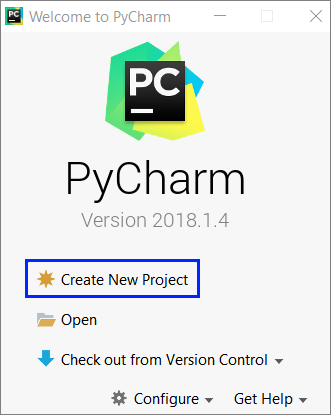
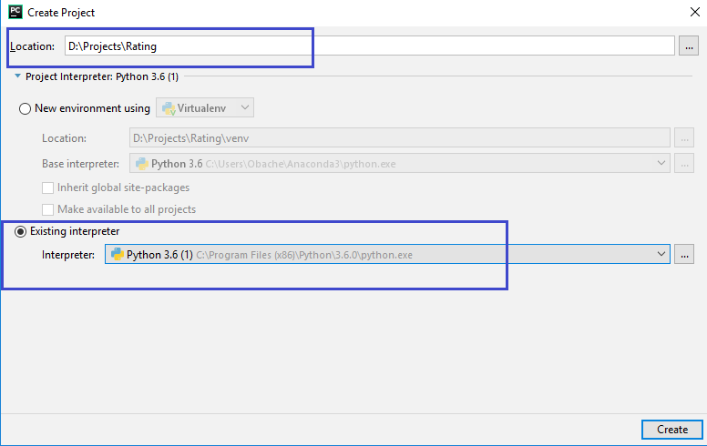
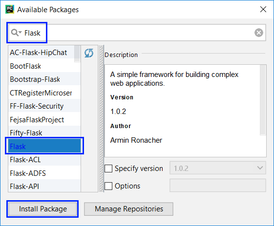
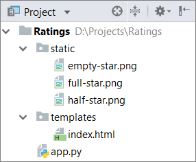
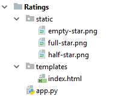
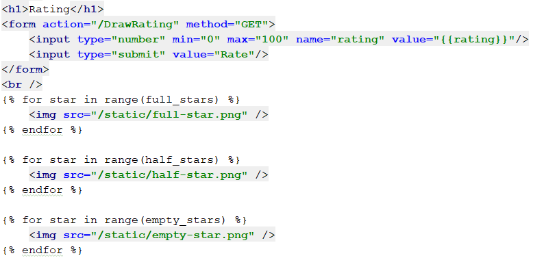
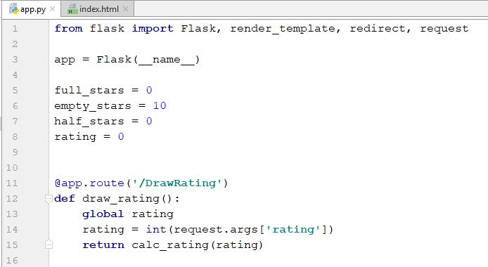
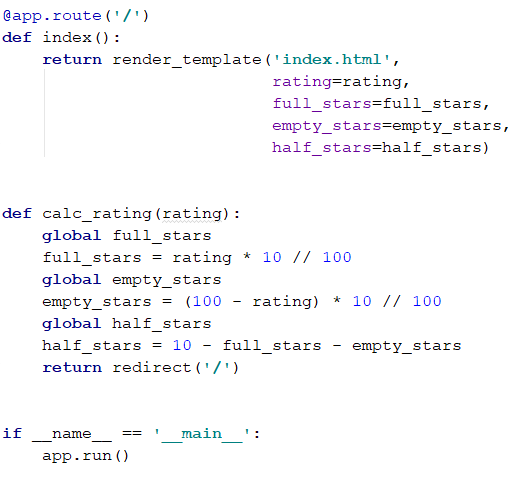
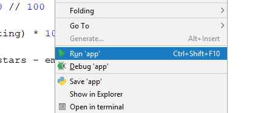

# Глава 6.1. Вложени цикли

В настоящата глава ще разгледаме **вложените цикли** и как да използваме **`for`** цикли за **чертане** на различни **фигурки на конзолата**, които се състоят от символи и знаци, разположени в редове и колони на конзолата. Ще използваме **единични** и **вложени цикли** (цикли един в друг), **изчисления** и **проверки**, за да отпечатваме на конзолата прости и не чак толкова прости фигурки по зададени размери.


## Видео

<div class="video-player">
  Гледайте видео-урок по тази глава тук: <a target="_blank"
  href="https://www.youtube.com/watch?v=kkxl1bitNAg">
  https://www.youtube.com/watch?v=kkxl1bitNAg</a>.
</div>


### Пример: правоъгълник от 10 x 10 звездички

Да се начертае в конзолата правоъгълник от **10 x 10** звездички.

|Вход|Изход|
|---|---|
|(няма)|<code>\*\*\*\*\*\*\*\*\*\*</code><br><code>\*\*\*\*\*\*\*\*\*\*</code><br><code>\*\*\*\*\*\*\*\*\*\*</code><br><code>\*\*\*\*\*\*\*\*\*\*</code><br><code>\*\*\*\*\*\*\*\*\*\*</code><br><code>\*\*\*\*\*\*\*\*\*\*</code><br><code>\*\*\*\*\*\*\*\*\*\*</code><br><code>\*\*\*\*\*\*\*\*\*\*</code><br><code>\*\*\*\*\*\*\*\*\*\*</code><br><code>\*\*\*\*\*\*\*\*\*\*</code>|

#### Насоки и подсказки


Как работи примерът? Инициализира се **цикъл с променлива `i`**. Началната стойност по подразбиране на променливата е **`i = 0`**. С всяка итерация на цикъла променливата се увеличава с **1**, докато е **по-малка от 10**. Така кодът в тялото на цикъла се изпълнява **10 пъти** - от **0<sup>-ия</sup>** до **9<sup>-ия</sup>** път включително. В тялото на цикъла се печата на нов ред в конзолата **`'*' * 10`**, което създава низ (стринг) от 10 звездички.

#### Тестване в Judge системата

Тествайте решението си тук: [https://judge.softuni.bg/Contests/Practice/Index/1055#0](https://judge.softuni.bg/Contests/Practice/Index/1055#0).


### Пример: правоъгълник от N x N звездички

Да се напише програма, която въвежда цяло положително число **n** и печата на конзолата **правоъгълник от N x N звездички**.

|Вход|Изход|Вход|Изход|Вход|Изход|
|---|---|---|---|---|---|
|2|<code>\*\*</code><br><code>\*\*</code>|3|<code>\*\*\*</code><br><code>\*\*\*</code><br><code>\*\*\*</code>|4|<code>\*\*\*\*</code><br><code>\*\*\*\*</code><br><code>\*\*\*\*</code><br><code>\*\*\*\*</code>|

#### Насоки и подсказки

Задачата е аналогична с предходната:


#### Тестване в Judge системата

Тествайте решението си тук: [https://judge.softuni.bg/Contests/Practice/Index/1055#1](https://judge.softuni.bg/Contests/Practice/Index/1055#1).


## Вложени цикли

Вложените цикли представляват конструкция, при която **в тялото на един цикъл** (външен) **се изпълнява друг цикъл** (вътрешен). За всяко завъртане на външния цикъл, вътрешният се извърта **целият**. Това се случва по следния начин:

 - При стартиране на изпълнение на вложени цикли първо **стартира външният цикъл**: извършва се **инициализация** на неговата управляваща променлива и след проверка за край на цикъла, се изпълнява кодът в тялото му.
 - След това се **изпълнява вътрешният цикъл**. Извършва се инициализация на началната стойност на управляващата му променлива, прави се проверка за край на цикъла и се изпълнява кодът в тялото му.
 - При достигане на зададената стойност за **край на вътрешния цикъл**, програмата се връща една стъпка нагоре и се продължава започналото изпълнение на външния цикъл. Променя се с една стъпка управляващата променлива за външния цикъл, проверява се дали условието за край е удовлетворено и **започва ново изпълнение на вложения (вътрешния) цикъл**.
 - Това се повтаря, докато променливата на външния цикъл достигне условието за **край на цикъла**.

Ето и един **пример**, с който нагледно да илюстрираме вложените цикли. Целта е да се отпечата отново правоъгълник от **N x N звездички**, като за всеки ред се извърта цикъл от **1** до **N**, а за всяка колона се извърта вложен цикъл от **1** до **N**:


В езика **Python**, когато стандартната начална стойност на променливата в цикъла (**`i = 0`**) не ни върши работа, можем да я променим със горепосочения синтаксис. Т.е. когато искаме цикълът да започва от **1** и да се върти до **`n`** включително, пишем: **`for i in range(1, n + 1)`**. Първата стойност в скобите указва началото на цикъла, а втората - края на цикъла, но не включително, т.е. цикълът свършва, преди да се достигне до нея.

Да разгледаме примера по-горе. След инициализацията на **първия (външен) цикъл**, започва да се изпълнява неговото **тяло**, което съдържа **втория (вложен) цикъл**. Той сам по себе си печата на един ред **`n`** на брой звездички. След като **вътрешният** цикъл **приключи** изпълнението си при първата итерация на външния, то след това **външният ще продължи**, т.е. ще отпечата един празен ред на конзолата. **След това** ще се извърши **обновяване** на променливата на **първия** цикъл и отново ще бъде изпълнен целият **втори**  (вложен) цикъл. Вътрешният цикъл ще се изпълни толкова пъти, колкото се изпълнява тялото на външния цикъл, в случая **`n`** пъти.

### Пример: квадрат от звездички

Да се начертае на конзолата квадрат от **N x N** звездички:

|Вход|Изход|Вход|Изход|Вход|Изход|
|---|---|---|---|---|---|
|2|<code>\* \*</code><br><code>\* \*</code>|3|<code>\* \* \*</code><br><code>\* \* \*</code><br><code>\* \* \*</code>|4|<code>\* \* \* \*</code><br><code>\* \* \* \*</code><br><code>\* \* \* \*</code><br><code>\* \* \* \*</code>|

#### Насоки и подсказки

Задачата е аналогична на предходната. Разликата тук е, че трябва да обмислим как да печатаме интервал след звездичките по такъв начин, че да няма излишни интервали в началото или края:


#### Тестване в Judge системата

Тествайте решението си тук: [https://judge.softuni.bg/Contests/Practice/Index/1055#2](https://judge.softuni.bg/Contests/Practice/Index/1055#2).


### Пример: триъгълник от долари

Да се напише програма, която въвежда число **n** и печата **триъгълник от долари**.

|Вход|Изход|Вход|Изход|Вход|Изход
|---|---|---|---|---|---|
|3|<code>&dollar;</code><br><code>&dollar; &dollar;</code><br><code>&dollar; &dollar; &dollar;</code>|4|<code>&dollar;</code><br><code>&dollar; &dollar;</code><br><code>&dollar; &dollar; &dollar;</code><br><code>&dollar; &dollar; &dollar; &dollar;</code>|5|<code>&dollar;</code><br><code>&dollar; &dollar;</code><br><code>&dollar; &dollar; &dollar;</code><br><code>&dollar; &dollar; &dollar; &dollar;</code><br><code>&dollar; &dollar; &dollar; &dollar; &dollar;</code>|

#### Насоки и подсказки

Задачата е **сходна** с тези за рисуване на **правоъгълник** и **квадрат**. Отново ще използваме **вложени цикли**, но тук има **уловка**. Разликата е в това, че **броя на колонките**, които трябва да разпечатаме, зависят от **реда**, на който се намираме, а не от входното число **`n`**. От примерните входни и изходни данни забелязваме, че **броят на доларите зависи** от това на кой **ред** се намираме към момента на печатането, т.е. 1 долар означава първи ред, 3 долара означават трети ред и т.н. Нека разгледаме долния пример по-подробно. Виждаме, че **променливата** на **вложения** цикъл е обвързана с променливата на **външния**. По този начин нашата програма печата желания триъгълник:


#### Тестване в Judge системата

Тествайте решението си тук: [https://judge.softuni.bg/Contests/Practice/Index/1055#3](https://judge.softuni.bg/Contests/Practice/Index/1055#3).


### Пример: квадратна рамка

Да се напише програма, която въвежда цяло положително число **n** и чертае на конзолата **квадратна рамка** с размер **N x N**.

|Вход|Изход|Вход|Изход|
|---|---|---|---|
|3|<code>+ - +</code><br><code>&#124; - &#124;</code><br><code>+ - +</code>|4|<code>+ - - +</code><br><code>&#124; - - &#124;</code><br><code>&#124; - - &#124;</code><br><code>+ - - +</code>|

|Вход|Изход|Вход|Изход|
|---|---|---|---|
|5|<code>+ - - - +</code><br><code>&#124; - - - &#124;</code><br><code>&#124; - - - &#124;</code><br><code>&#124; - - - &#124;</code><br><code>+ - - - +</code>|6|<code>+ - - - - +</code><br><code>&#124; - - - - &#124;</code><br><code>&#124; - - - - &#124;</code><br><code>&#124; - - - - &#124;</code><br><code>&#124; - - - - &#124;</code><br><code>+ - - - - +</code>|

#### Насоки и подсказки

Можем да решим задачата по следния начин:
* Четем от конзолата числото **`n`**.
* Отпечатваме **горната част**: първо знак **`+`**, после **n-2** пъти **`-`** и накрая знак **`+`**.
* Отпечатваме **средната част**: печатаме **n-2** реда като първо печатаме знак **`|`**, после **n-2** пъти **`-`** и накрая отново знак **`|`**. Това можем да го постигнем с вложени цикли.
* Отпечатваме **долната част**: първо **`+`**, после **n-2** пъти **`-`** и накрая **`+`**.

Ето и примерна имплементация на описаната идея с вложени цикли:


#### Тестване в Judge системата

Тествайте решението си тук: [https://judge.softuni.bg/Contests/Practice/Index/1055#4](https://judge.softuni.bg/Contests/Practice/Index/1055#4).


### Пример: ромбче от звездички

Да се напише програма, която въвежда цяло положително число **n** и печата **ромбче от звездички** с размер **N**.

|Вход|Изход|Вход|Изход|
|---|---|---|---|
|1|<code>\*</code>|2|<code>&nbsp;\*&nbsp;</code><br><code>\*&nbsp;\*</code><br><code>&nbsp;\*&nbsp;</code><br>|


|Вход|Изход|Вход|Изход|
|---|---|---|---|
|3|<code>&nbsp;&nbsp;\*&nbsp;&nbsp;</code><br><code>&nbsp;\*&nbsp;\*&nbsp;</code><br><code>\*&nbsp;\*&nbsp;\*</code><br><code>&nbsp;\*&nbsp;\*&nbsp;</code><br><code>&nbsp;&nbsp;\*&nbsp;&nbsp;</code>|4|<code>&nbsp;&nbsp;&nbsp;\*&nbsp;&nbsp;&nbsp;</code><br><code>&nbsp;&nbsp;\*&nbsp;\*&nbsp;&nbsp;</code><br><code>&nbsp;\*&nbsp;\*&nbsp;\*&nbsp;</code><br><code>\*&nbsp;\*&nbsp;\*&nbsp;\*</code><br><code>&nbsp;\*&nbsp;\*&nbsp;\*&nbsp;</code><br><code>&nbsp;&nbsp;\*&nbsp;\*&nbsp;&nbsp;</code><br><code>&nbsp;&nbsp;&nbsp;\*&nbsp;&nbsp;&nbsp;</code>|

#### Насоки и подсказки

За решението на тази задача е нужно да **разделим** мислено **ромба** на **две части** - **горна**, която включва **и** средния ред, и **долна**. За **разпечатването** на всяка една част ще използваме **два** отделни цикъла, като оставяме на читателя сам да намери зависимостта между **`n`** и променливите на циклите. За първия цикъл може да използваме следните насоки:

* Отпечатваме **`n-row`** интервала.
* Отпечатваме **`*`**.
* Отпечатваме **`row-1`** пъти **`*`**.

**Втората** (долна) част ще разпечатаме по **аналогичен** начин, което отново оставяме на читателя да се опита да направи сам.


<table><tr><td></td>
  <td>В езика Python стандартната стъпка на <strong><code>for</code></strong> цикъла е положителна и е равна на 1. Ако искаме да я променим, трябва при аргументите на цикъла да използваме трети параметър: <code><b>for i in range (0, 100, 2)</b></code>. Третият параметър в случая показва, че променливата ще се увеличава от 0 до 99 включително, със стъпка 2.</td>
</tr></table>

#### Тестване в Judge системата

Тествайте решението си тук: [https://judge.softuni.bg/Contests/Practice/Index/1055#5](https://judge.softuni.bg/Contests/Practice/Index/1055#5).

### Пример: коледна елха

Да се напише програма, която въвежда число **n** (1 ≤ n ≤ 100) и печата коледна елха с височина **N + 1**.

|Вход|Изход|Вход|Изход|
|---|---|---|---|
|1|<code>&nbsp;&nbsp;&#124;&nbsp;&nbsp;</code><br><code>\*&nbsp;&#124;&nbsp;\*</code>|2|<code>&nbsp;&nbsp;&nbsp;&#124;&nbsp;&nbsp;&nbsp;</code><br><code>&nbsp;\*&nbsp;&#124;&nbsp;\*&nbsp;</code><br><code>\*\*&nbsp;&#124;&nbsp;\*\*</code>|

|Вход|Изход|Вход|Изход|
|---|---|---|---|
|3|<code>&nbsp;&nbsp;&nbsp;&nbsp;&#124;&nbsp;&nbsp;&nbsp;&nbsp;</code><br><code>&nbsp;&nbsp;\*&nbsp;&#124;&nbsp;\*&nbsp;&nbsp;</code><br><code>&nbsp;\*\*&nbsp;&#124;&nbsp;\*\*&nbsp;</code><br><code>\*\*\*&nbsp;&#124;&nbsp;\*\*\*</code>|4|<code>&nbsp;&nbsp;&nbsp;&nbsp;&nbsp;&#124;&nbsp;&nbsp;&nbsp;&nbsp;&nbsp;</code><br><code>&nbsp;&nbsp;&nbsp;\*&nbsp;&#124;&nbsp;\*&nbsp;&nbsp;&nbsp;</code><br><code>&nbsp;&nbsp;\*\*&nbsp;&#124;&nbsp;\*\*&nbsp;&nbsp;</code><br><code>&nbsp;\*\*\*&nbsp;&#124;&nbsp;\*\*\*&nbsp;</code><br><code>\*\*\*\*&nbsp;&#124;&nbsp;\*\*\*\*</code>|

#### Насоки и подсказки

От примерите виждаме, че елхата може да бъде **разделена** на **три** логически части. Първата част са **звездичките и празните места преди и след тях**, средната част е **` | `**, а последната част са отново **звездички**, като този път **празни** места има само **преди** тях. Разпечатването може да бъде постигнато само с **един цикъл** и операцията **умножаване на стринг**, която ще използваме един път за звездичките и един път за интервалите: 


#### Тестване в Judge системата

Тествайте решението си тук: [https://judge.softuni.bg/Contests/Practice/Index/1055#6](https://judge.softuni.bg/Contests/Practice/Index/1055#6).


## Чертане на по-сложни фигури

Да разгледаме как можем да чертаем на конзолата фигури с по-сложна логика на конструиране, за които трябва повече да помислим, преди да почнем да пишем.

### Пример: слънчеви очила
Да се напише програма, която въвежда цяло число **n** (3 ≤ n ≤ 100) и печата слънчеви очила с размер **5\*N x N** като в примерите:

|Вход|Изход|Вход|Изход|
|---|---|---|---|
|3|<code>\*\*\*\*\*\*&nbsp;&nbsp;&nbsp;\*\*\*\*\*\*</code><br><code>\*////\*&#124;&#124;&#124;\*////\*</code><br><code>\*\*\*\*\*\*&nbsp;&nbsp;&nbsp;\*\*\*\*\*\*</code>|4|<code>\*\*\*\*\*\*\*\*&nbsp;&nbsp;&nbsp;&nbsp;\*\*\*\*\*\*\*\*</code><br><code>\*//////\*&#124;&#124;&#124;&#124;\*//////\*</code><br><code>\*//////\*&nbsp;&nbsp;&nbsp;&nbsp;\*//////\*</code><br><code>\*\*\*\*\*\*\*\*&nbsp;&nbsp;&nbsp;&nbsp;\*\*\*\*\*\*\*\*</code><br>|

|Вход|Изход|
|---|---|
|5|<code>\*\*\*\*\*\*\*\*\*\*&nbsp;&nbsp;&nbsp;&nbsp;&nbsp;\*\*\*\*\*\*\*\*\*\*</code><br><code>\*////////\*&nbsp;&nbsp;&nbsp;&nbsp;&nbsp;\*////////\*</code><br><code>\*////////\*&#124;&#124;&#124;&#124;&#124;\*////////\*</code><br><code>\*////////\*&nbsp;&nbsp;&nbsp;&nbsp;&nbsp;\*////////\*</code><br><code>\*\*\*\*\*\*\*\*\*\*&nbsp;&nbsp;&nbsp;&nbsp;&nbsp;\*\*\*\*\*\*\*\*\*\*</code><br>|

#### Насоки и подсказки

От примерите виждаме, че очилата могат да се разделят на **три части** – горна, средна и долна. По-долу е част от кода, с който задачата може да се реши.

При рисуването на горния и долния ред трябва да се изпечатат **`2 * n`** звездички, **`n`** интервала и **`2 * n`** звездички:


При печатането на **средната** част трябва да **проверим** дали редът е **`(n  -1) // 2 - 1`**, тъй като от примерите е видно, че на **този ред** трябва да печатаме **вертикални чертички** вместо интервали:


#### Тестване в Judge системата

Тествайте решението си тук: [https://judge.softuni.bg/Contests/Practice/Index/1055#7](https://judge.softuni.bg/Contests/Practice/Index/1055#7).

### Пример: къщичка

Да се напише програма, която въвежда число **n** (2 ≤ **n** ≤ 100) и печата **къщичка** с размери **N x N**, точно като в примерите:

|Вход|Изход|Вход|Изход|Вход|Изход|
|---|---|---|---|---|---|
|2|<code>**</code><br><code>&#124;&#124;</code><br>|3|<code>-\*-</code><br><code>\*\*\*</code><br><code>&#124;\*&#124;</code>|4|<code>-\*\*-</code><br><code>\*\*\*\*</code><br><code>&#124;\*\*&#124;</code><br><code>&#124;\*\*&#124;</code>

|Вход|Изход|Вход|Изход|
|---|---|---|---|
|5|<code>--\*--</code><br><code>-\*\*\*-</code><br><code>\*\*\*\*\*</code><br><code>&#124;\*\*\*&#124;</code><br><code>&#124;\*\*\*&#124;</code>|8|<code>---\*\*---</code><br><code>--\*\*\*\*--</code><br><code>-\*\*\*\*\*\*-</code><br><code>\*\*\*\*\*\*\*\*</code><br><code>&#124;\*\*\*\*\*\*&#124;</code><br><code>&#124;\*\*\*\*\*\*&#124;</code><br><code>&#124;\*\*\*\*\*\*&#124;</code><br><code>&#124;\*\*\*\*\*\*&#124;</code><br>|


#### Насоки и подсказки

Разбираме от условието на задачата, че къщата е с размер **`n` x `n`**. Това, което виждаме от примерните вход и изход, е, че:

* Къщичката е разделена на 2 части: **покрив и основа**. 


* Когато **`n`** е четно число, върхът на къщичката е тъп.
* Когато **`n`** е нечетно число, **покривът** е с остър връх и с един ред по-голям от **основата**.

##### Покрив
* Съставен е от **звезди** и **тирета**.
* В най-високата си част има една или две звезди, спрямо това дали **n** e четно или нечетно, както и тирета.
* В най-ниската си част има много звезди и малко или никакви тирета.
* С всеки един ред по-надолу **звездите** се увеличават с 2, а **тиретата** намаляват също с 2.

##### Основа
* Дълга е **`n`** на брой реда.
* Съставена е от **звезди** и **вертикални черти**.
* Редовете са съставени от 2 **вертикални черти** - по една в началото и в края на реда, както и **звезди** между чертите с дължина на низа **`n - 2`**.  

Прочитаме входното число **`n`** от конзолата и записваме стойността му в променлива:  


<table><tr><td></td>
<td><b>Много е важно да проверяваме дали са валидни входните данни!</b> В тези задачи не е проблем директно да обръщаме прочетеният вход от конзолата в тип <b><code>int</code></b>, защото изрично е казано, че ще получаваме валидни целочислени числа. Ако обаче правим по-сериозни приложения, е добра практика да проверяваме данните. Какво ще стане, ако вместо число потребителят въведе например буквата "А"?</td>
</tr></table>

За да начертаем **покрива**, записваме колко ще е началният брой **звезди** в променлива **`stars`**:
* Ако **`n`** е **нечетно** число, ще е 1 брой.
* Ако **`n`** е **четно**, ще са 2 броя.


Изчисляваме дължината на **покрива**. Тя е равна на половината от **`n`**. Резултата записваме в променливата **`roof_length`**:


**Забележка:** За да използваме **`math.ceil()`**, която закръгля към по-голямото цяло число, без значение от дробната част, е необходимо да въведем библиотеката **`math`**. Това става с командата **`import math`**. Препоръчително е да напишем **`import math`** (както и всички други import-и) още в началото на файла.

Важно е да съобразим, че когато **`n`** е нечетно число, дължината на покрива е по-голяма с един ред от тази на **основата**. 

В езика **Python**, когато два целочислени типа се делят и има остатък, то резултатът ще е число с остатък. Ако искаме да извършим чисто целочислено деление без остатък, е необходимо да използваме оператора **`//`**.

Пример:

```python
result1 = 3 / 2    # резултат 1.5
result2 = 3 // 2   # резултат 1
```

Ако искаме да закръглим резултата нагоре, трябва да използваме метода **`math.cail(…)`**:
**`result = math.ceil(3 / 2)`**.

След като сме изчислили дължината на покрива, завъртаме цикъл от 0 до **`roof_length`**. На всяко повторение ще:
* Изчисляваме броя **тирета**, които трябва да изрисуваме. Броят ще е равен на **`(n - stars) / 2`**. Записваме го в променлива **`padding`**.


* Отпечатваме на конзолата: "**тирета**" (**`padding`** на брой пъти) + "**звезди**" (**`stars`** пъти) + "**тирета**" (**`padding`** пъти). 


* Преди да завърши въртенето на цикъла увеличаваме **`stars`** (броя на **звездите**) с 2.


След като сме приключили с покрива, е време за **основата**. Тя е по-лесна за печатане:
* Започваме с цикъл от 0 до **`n`** (изключено).
* Отпечатваме на конзолата: **`|`** + **`*`** (**`n - 2`** на брой пъти) + **`|`**.


Ако всичко сме написали както трябва, задачата ни е решена.

#### Тестване в Judge системата

Тествайте решението си тук: [https://judge.softuni.bg/Contests/Practice/Index/1055#8](https://judge.softuni.bg/Contests/Practice/Index/1055#8).

### Пример: диамант

Да се напише програма, която приема цяло число **n** (1 ≤ **n** ≤ 100) и печата диамант с размер **N**, като в следните примери:

|Вход|Изход|Вход|Изход|Вход|Изход|
|---|---|---|---|---|---|
|1|<code>\*</code><br>|2|<code>\*\*</code>|3|<code>-\*-</code><br><code>\*-\*</code><br><code>-\*-</code>|

|Вход|Изход|Вход|Изход|Вход|Изход|
|---|---|---|---|---|---|
|4|<code>-\*\*-</code><br><code>\*--\*</code><br><code>-\*\*-</code>|5|<code>--\*--</code><br><code>-\*-\*-</code><br><code>\*---\*</code><br><code>-\*-\*-</code><br><code>--\*--</code><br>|6|<code>--\*\*--</code><br><code>-\*--\*-</code><br><code>\*----\*</code><br><code>-\*--\*-</code><br><code>--\*\*--</code><br>|

|Вход|Изход|Вход|Изход|Вход|Изход|
|---|---|---|---|---|---|
|7|<code>---\*---</code><br><code>--\*-\*--</code><br><code>-\*---\*-</code><br><code>\*-----\*</code><br><code>-\*---\*-</code><br><code>--\*-\*--</code><br><code>---\*---</code><br>|8|<code>---\*\*---</code><br><code>--\*--\*--</code><br><code>-\*----\*-</code><br><code>\*------\*</code><br><code>-\*----\*-</code><br><code>--\*--\*--</code><br><code>---\*\*---</code><br>|9|<code>----\*----</code><br><code>---\*-\*---</code><br><code>--\*---\*--</code><br><code>-\*-----\*-</code><br><code>\*-------\*</code><br><code>-\*-----\*-</code><br><code>--\*---\*--</code><br><code>---\*-\*---</code><br><code>----\*----</code>|

#### Насоки и подсказки

Това, което знаем от условието на задачата, е че диамантът е с размер **`n` x `n`**. От примерните вход и изход можем да си направим извода, че всички редове съдържат точно по **`n`** символа и всички редове, с изключение на горните върхове, имат по **2 звезди**. Можем мислено да разделим диаманта на 2 части:
* **Горна** част. Тя започва от горния връх до средата.
* **Долна** част. Тя започва от реда след средата до най-долния връх включително.

##### Горна част

* Ако **`n`** е **нечетно**, то тя започва с **1 звезда**.
* Ако **`n`** е **четно**, то тя започва с **2 звезди**.
* С всеки ред надолу звездите се отдалечават една от друга.
* Пространството между, преди и след **звездите** е запълнено с **тирета**.

##### Долна част

* С всеки ред надолу звездите се приближават една към друга. Това означава, че пространството (**тиретата**) между тях намалява, а пространството (**тиретата**) отляво и отдясно се увеличава.
* В най-долната си част е с 1 или 2 **звезди**, спрямо това дали **`n`** е четно или не.

##### Горна и долна част на диаманта

* На всеки ред звездите са заобиколени от външни **тирета**, с изключение на средния ред.
* На всеки ред има пространство между двете **звезди**, с изключение на първия и последния ред (понякога **звездата е 1**).

Прочитаме стойността на **`n`** от конзолата, като я конвертираме до тип **`int`**:


Започваме да печатаме на конзолата горната част на диаманта. Първото нещо, което трябва да направим, е да изчислим началната стойност на външната бройка **тирета `left_right`** (тиретата от външната част на **звездите**). Тя е равна на **`(n - 1) / 2`**, закръглено надолу:


След като сме изчислили **`left_right`**, започваме да чертаем **горната част** на диаманта. Може да започнем, като завъртим **цикъл** от **`0`** до **`(n + 1) // 2 `** (т.е. закръглено надолу).  

При всяко завъртане на цикъла трябва да се изпълнят следните стъпки:

* Печатане на левите **тирета** на конзолата (с дължина **`left_right`**) и веднага след тях първата **звезда**.


* Изчисляване на разстоянието между двете **звезди**. Може да го направим като извадим от **`n`** дължината на външните **тирета**, както и числото 2 (бройката на **звездите**, т.е. очертанията на диаманта). Резултата от тази разлика записваме в променлива **`mid`**.


* Ако стойността на **`mid`** е по-малка от 0, то тогава знаем, че на този ред трябва да има 1 звезда. Ако е по-голяма или равно на 0, то тогава трябва да начертаем **тирета** с дължина **`mid`** и една **звезда** след тях.
* Печатаме на конзолата десните външни **тирета** с дължина също **`left_right`**. 


* В края на цикъла намаляваме стойността на **`left_right`** с 1 (**звездите** се отдалечават).

Готови сме с горната част.

Чертането на долната част е доста подобно на това на горната част. Разликата е, че вместо да намаляме стойността на **`left_right`** с 1 към края на цикъла, ще я увеличаваме с 1 в началото на цикъла. Също така **цикълът ще се върти от 0 до `(n - 1) // 2`**:


<table><tr><td></td>
<td><b>Повторението на код се смята за лоша практика</b>, защото кодът става доста труден за поддръжка. Нека си представим, че имаме парче код (напр. логиката за чертането на ред от диаманта) на още няколко места и решаваме да направим промяна. За целта би било необходимо да минем през всичките места и да направим промените. А сега нека си представим, че трябва да използвате код не 1, 2 или 3 пъти, а десетки пъти. Начин за справяне с този проблем е като се използват <b>функции</b>. Можете да потърсите допълнителна информация за тях в Интернет или да прегледате <a href="/chapter-10-methods.md">Глава 10. Функции</a>.</td>
</tr></table>

Ако сме написали всичко коректно, задачата ни е решена.

#### Тестване в Judge системата

Тествайте решението си тук: [https://judge.softuni.bg/Contests/Practice/Index/1055#9](https://judge.softuni.bg/Contests/Practice/Index/1055#9).


## Какво научихме от тази глава?

Запознахме се с един от начините за създаване на низове:

```python
print_me = '*' * 5
```

Научихме се да чертаем фигури с вложени **`for`** цикли:

```python
for row in range(5):
    print('*', end='')

    for col in range(4):
        print(' *', end='')

    print()
```

## Упражнения: Чертане на фигурки в уеб среда

Сега, след като свикнахме с **вложените цикли** и как да ги използваме, за да чертаем фигурки на конзолата, можем да се захванем с нещо още по-интересно: да видим как циклите могат да се използват за **чертане в уеб среда**. Ще направим уеб приложение, което визуализира числов рейтинг (число от 0 до 100) със звездички. Такава визуализация се среща често в сайтове за електронна търговия, ревюта на продукти, оценки на събития, рейтинг на приложения и други.

Не се притеснявайте, ако не разберете целия код, как точно е направен и как точно работи проектът. Нормално е, сега се учим да пишем код, не сме стигнали до технологиите за уеб разработка. Ако имате трудности да си напишете проекта, следвайки описаните стъпки, питайте в СофтУни форума: https://softuni.bg/forum.

### Задача: рейтинги – визуализация в уеб среда

Да се разработи уеб приложение за визуализация на рейтинг (число от 0 до 100). Чертаят се от 1 до 10 звездички (с половинки). Звездичките да се генерират с **`for`** цикъл. 


#### Насоки и подсказки

Започваме като създаваме нов проект в **PyCharm** от [**File**] -> [**New Project**] (или от началния прозорец):



Даваме смислено име на проекта, например "Ratings". Избираме тип на текущия **Python интерпретатор**. Нека да е този по подразбиране:



Ще използваме отново библиотеката Flask, която служи за създаване на уеб приложения. Преди да започнем да пишем код, трябва да инсталираме Flask. Нека си припомним как ставаше това. Отиваме в настройките на PyCharm [**File**] -> [**Settings**] -> [**Project: Ratings**] -> [**Project Interpreter**]. Там, натискаме бутона **`+`**:


Търсим **Flask** в прозореца, който излиза и натискаме бутона [**Install Package**]:



Сега добавяме **структурата** на проекта (файловете със заданието за този проект могат да бъдат свалени от [тук](https://github.com/SoftUni/Programming-Basics-Book-Python-BG/tree/chapter-06-nested-loops/assets/chapter-6-1-assets)). Копираме ги от Windows Explorer и ги поставяме в папката на проекта **Ratings** с Copy/Paste:



За да заработи всичко, трябва да допишем кода. Първо отиваме във файла **index.html** (от папка templates) и търсим **TODO** секциите. На тяхно място въвеждаме следния код:



Горният код създава уеб форма **`<form>`** с едно поле **`"rating"`** за въвеждане на число в интервала [**0 … 100**] и бутон [**Rate**] за изпращане на данните от формата към сървъра. След което, рисува с три отделни **for** цикъла съответния брой звездички - запълнени, полупразни и празни.

Действието, което ще обработи данните, се казва **`/DrawRatings`**, което означава функция **`draw_ratings()`** във файла **`app.py`**:



Кодът от функцията **`draw_ratings()`** взима въведеното число **`rating`** от формата и го подава на функцията **`calc_rating(…)`**. Функцията **`calc_rating(…)`** извършва пресмятания и изчислява броя **пълни звездички**, броя **празни звездички** и броя **половинки звездички**, след което зарежда отново страницата, но вече с подадени нови стойности на променливите за звездичките. Имплементираме я по следния начин:



Стартираме проекта с [**Ctrl+Shift+F10**] (или с [**Десен бутон**] -> [**Run 'app'**]) и изчакваме да се зареди:



Отиваме на посочения адрес и се наслаждаваме на готовия проект:



Ако имате проблеми с примерния проект по-горе, може да задавате въпроси във **форума на СофтУни**: [https://softuni.bg/forum](https://softuni.bg/forum).
